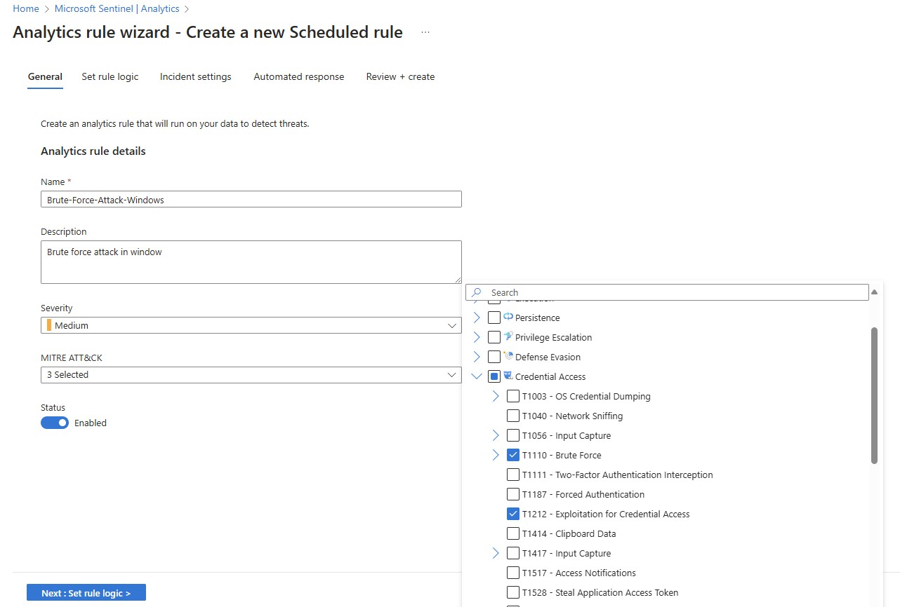
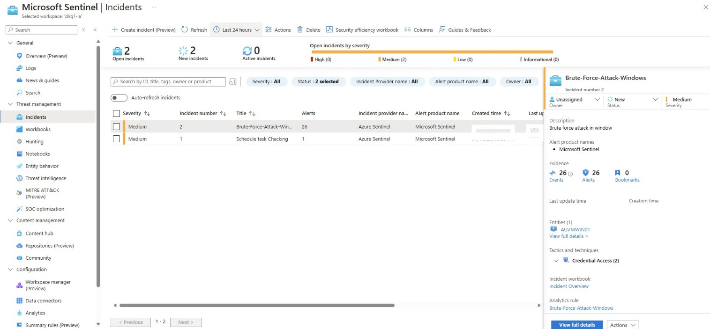
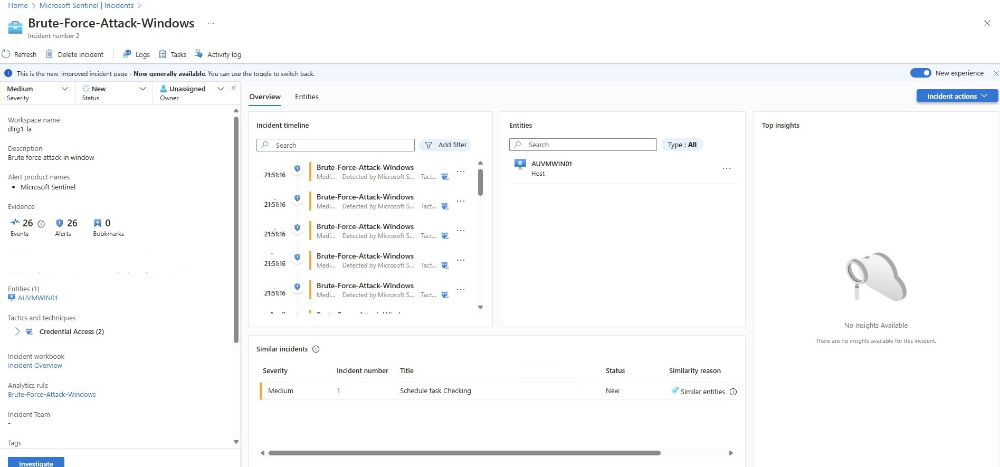

# Azure Cloud SOC Lab – Part II

## Threat Remediation & Hardening with Microsoft Sentinel

This project is **Part 2 of my [Azure SOC Honeypot Lab](https://github.com/Halomate/Sentinel-Honeypot-SOC-Lab)**.
In the first project, I deployed a vulnerable VM to attract and monitor real-world attacks using **Microsoft Sentinel** and **Log Analytics**.

In this lab, I move beyond detection and focus on **remediation and security hardening** by analyzing attacker activity and implementing defensive controls.

The goal of this project is to demonstrate the **complete SOC lifecycle**:

Detection → Investigation → Remediation → Hardening

---

# Lab Overview

This lab builds on the previously deployed honeypot environment and focuses on reducing attack exposure by implementing security controls within Azure.

## Key Objectives

* Analyze attack telemetry collected by Microsoft Sentinel
* Identify the most common threats targeting the honeypot
* Create detection rules for malicious activity
* Implement remediation steps to block attacker activity
* Harden the environment to prevent future attacks
* Measure the reduction of malicious activity after remediation

---

# Technologies Used

* Microsoft Azure
* Microsoft Sentinel (SIEM)
* Log Analytics Workspace
* Azure Network Security Groups (NSG)
* Microsoft Defender for Cloud
* Kusto Query Language (KQL)

---

# Step 1 – Analyze Attacker Activity in Sentinel

Using Microsoft Sentinel logs, I analyzed authentication failures to identify brute-force attacks targeting the honeypot.

Navigate to:

Microsoft Sentinel → Logs

Example KQL query used to identify failed login attempts:

```kql
SecurityEvent
| where EventID == 4625
| summarize FailedAttempts = count() by IpAddress
| sort by FailedAttempts desc
```

This query reveals:

* Top attacking IP addresses
* Frequency of login attempts
* Potential brute-force campaigns

### Findings

Common attack patterns observed included:

* RDP brute-force attempts
* Password spraying
* Reconnaissance scans from multiple geographic locations

Screenshots were captured showing attacker IPs and activity trends.

---

# Step 2 – Create Sentinel Detection Rule

To automatically detect suspicious activity, a **Sentinel Analytics Rule** was created.

Navigate to:

Microsoft Sentinel → Analytics → Create Rule

Detection query:

```kql
SecurityEvent
| where EventID == 4625
| summarize Attempts = count() by IpAddress
| where Attempts > 10
```

Rule configuration:

Severity: Medium
MITRE Tactic: Credential Access
Technique: Brute Force (T1110)

When triggered, this rule automatically generates **incidents in Microsoft Sentinel** for investigation.



---

# Step 3 – Incident Investigation

When alerts were triggered, incidents were investigated through the Sentinel portal.

Navigate to:

Microsoft Sentinel → Incidents

Each incident provided valuable investigation data including:

* Attacker IP address
* Targeted user accounts
* Login attempt frequency
* Geographic source of the attack

Using Sentinel investigation graphs allowed correlation between:

* Devices
* IP addresses
* Accounts
* Log activity

---

# Step 4 – Incident Response & Investigation

After identifying malicious IP addresses, remediation actions were taken by first assigning the incident and investigating.

Navigate to:

Sentinel → Incidents → View Full Detail



1. Assign the incident to SOC team member
2. Change the incident status, put the incident comment
3. Click Investigate → understand the incident workflow



---

# Step 5 – Harden Network Security Rules

Initially, the honeypot VM allowed RDP access from any IP address to intentionally attract attacks.

To secure the environment, inbound access was restricted.

Previous rule:

Any → Port 3389 → Allow

Updated rule:

Trusted IP → Port 3389 → Allow

This significantly reduced exposure to automated scanning and brute-force attacks.

---


